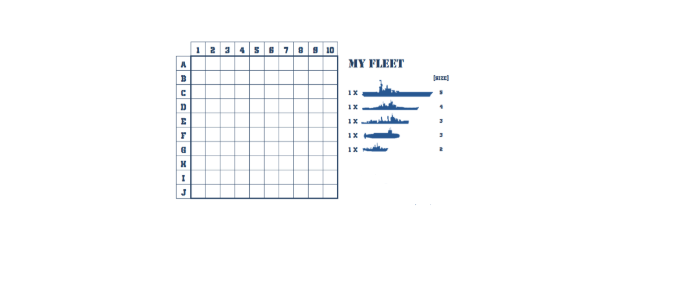

# DistributedApplicationProject
This project consists of a distributed web application for storing user's different accounts' credentials (Facebook account, Instagram account, Twitter account, Bank account, ...)

### I. Game Documentation

#### Battleship

**Game characteristics:**

- Battleship is a guessing/strategy game for two players. It is played on a 10-dimensional square matrix,
    on which each player places his fleet of ships and the individual squares of the matrix are identified by
    a letter and a number.
- Each ship occupies a number of consecutive squares on the grid, arranged either horizontally or
    vertically. And the number of squares for each ship is determined by the type of the ship:
       Carrier -> 5 squares
       Battleship -> 4 squares
       Cruiser -> 3 squares
       Submarine -> 3 squares
       Destroyer -> 2 squares
- The locations of the opposing fleets are not visible for one player.



**Concurrency:**

```
Players won’t be taking turns to play and the principle shared resource will be the matrix or the game
field. So, the access to the matrix or the game field will create the concurrency.
```

**Game Objective:**

```
The objective of the game is to destroy the opposing player’s fleet.
```
## Typical game scenario:

1. Before play begins, each player chooses his ships locations on the grid based on his strategic
    choices.
2. Each player is able to fire by choosing one location in the grid (letter, number). After each fire,
    the player will see if his shot was a “hit” by a red cross, or a “miss” by a black one in his grid for
    his further strategies in the game. If there was a hit, the opponent’s ship is down, in other
    words the number of his ships will decrease by one.
3. The first to lose all his ships loses.
